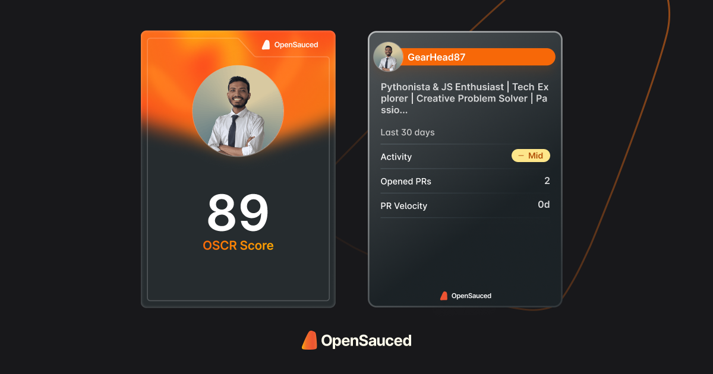

  

###

# Hey There, I'm Hossain 👋

# 💫 About Me:
I'm a passionate programmer from Bangladesh. I'm passionate about personal and professional growth and am currently dedicated to expanding my knowledge of new technologies.  
🔭 I’m currently working on various web development projects. 🌱 I'm continuously learning and believe every day is an opportunity to gain new knowledge. 
👯 I’m open to work and employment opportunities, including remote and relocation options. 
💬 Feel free to ask me about React.js, web development, or any new technologies.

## 🌐 Socials:
      

## 🛠️ Technologies & Tools
                                

##

# 📊 GitHub Stats:
 

## Check out my open-source contribution snapshot! 👇

## 🏆 GitHub Trophies

### 🔝 Top Contributed Repo

---

